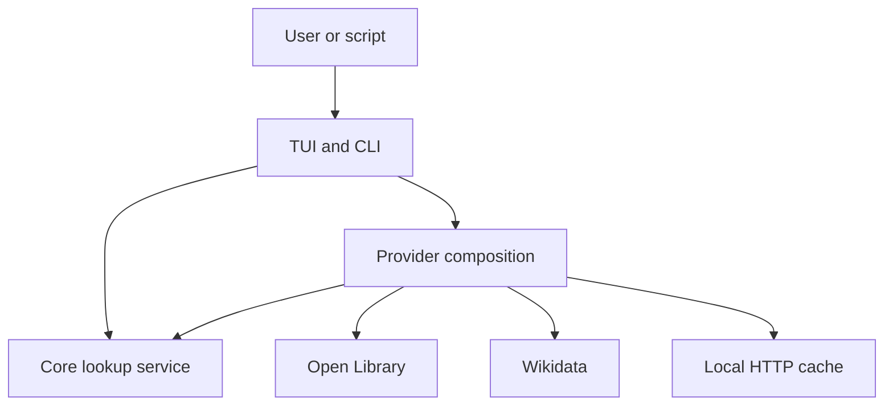
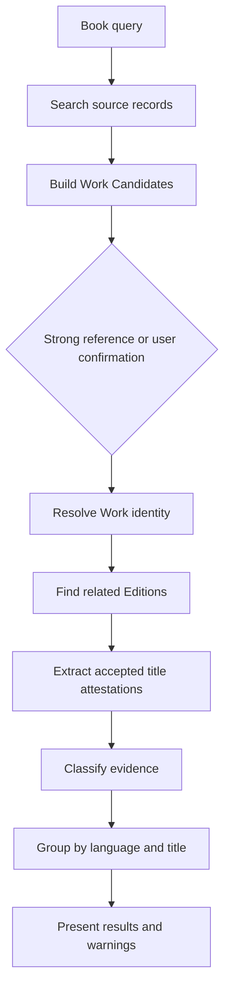

# Architecture

## System Shape

Book Title Lookup is a local modular application. The MVP has one executable,
no HTTP server, and no remotely deployed component owned by this project.



The architecture separates bibliographic policy from terminal rendering and
external API shapes. Data-source gaps are handled as evidence and reconciliation
problems, not hidden behind a single supposedly canonical upstream record.

## Workspace

The Node.js TypeScript workspace is:

```text
/
├── apps/
│   └── tui/
├── packages/
│   ├── core/
│   └── providers/
├── scripts/
├── docs/
│   └── adr/
├── testing/
├── CONTEXT.md
├── package.json
├── package-lock.json
├── README.md
└── tsconfig.json
```

### `packages/core`

Core owns:

- domain types and invariants;
- query, resolution, and title-lookup use cases;
- evidence classification;
- candidate reconciliation;
- title grouping and deterministic recommendation;
- expected outcome types;
- ports required from provider composition.

Core does not import terminal packages, call `fetch`, read environment
variables, access files, or depend on provider response types.

### `packages/providers`

Providers owns:

- Open Library and Wikidata API clients;
- decoding and validation of upstream data;
- rate limiting, retry, and per-source deadlines;
- source-specific record mapping;
- the federated catalog implementation;
- raw HTTP response caching;
- platform configuration and cache locations.

Provider adapters can import domain contracts from Core. Core must not import
Providers.

### `apps/tui`

The application package owns:

- command parsing;
- full-screen rendering and terminal lifecycle;
- application state, messages, and effects;
- human-readable and JSON presentation;
- configuration precedence;
- construction and injection of providers into Core;
- mapping outcomes to process exit codes.

It is the composition root and may import both Core and Providers.

### `scripts`

Build and verification scripts produce and inspect the bundled npm CLI.
Generated artifacts live beneath `dist/` and are not source-tree members.

## Public Application Boundary

The UI consumes use-case-level operations rather than source-specific APIs:

```ts
interface BookTitleCatalog {
  search(
    query: BookQuery,
    options?: RequestOptions,
  ): Promise<SearchOutcome>;

  resolve(
    candidate: CandidateRef,
    options?: RequestOptions,
  ): Promise<ResolveOutcome>;

  findTitles(
    work: ResolvedWorkRef,
    query: TitleQuery,
    options?: RequestOptions,
  ): Promise<TitleLookupOutcome>;
}

interface RequestOptions {
  readonly signal?: AbortSignal;
}
```

These signatures are architectural examples, not a published plugin contract.
The types should be refined test-first with the first vertical slice.

Expected conditions use discriminated outcomes. Exceptions are reserved for
programming errors and violated invariants.

```ts
type SearchOutcome =
  | {
      readonly status: "found";
      readonly candidates: readonly WorkCandidate[];
      readonly warnings: readonly SourceWarning[];
    }
  | {
      readonly status: "not_found";
      readonly warnings: readonly SourceWarning[];
    }
  | {
      readonly status: "failed";
      readonly failures: readonly SourceFailure[];
    }
  | { readonly status: "cancelled" };
```

Title lookup separately represents `found`, `no_attested_titles`, `failed`, and
`cancelled`. Partial success is represented by successful data plus source
warnings, not by discarding the data or pretending the query fully succeeded.

## Provider Boundary

The MVP does not expose a third-party plugin API. Open Library and Wikidata do
not share enough semantics to justify a broad public `BookProvider` interface
before real implementations exist.

Provider composition instead exposes the evidence-oriented operations Core
needs. Source-specific clients and endpoint workflows remain private to
`packages/providers`. Test doubles implement the narrow Core-facing ports.

Raw upstream JSON never crosses the provider boundary. Decoders validate
required shape at runtime and map source records while preserving:

- source name;
- source record URL;
- namespaced external references;
- fetched-at timestamp;
- stale state;
- claims and their original provenance;
- decoding and conflict warnings.

## Lookup Pipeline



### Direct Resolution

A unique ISBN or explicit supported External Reference can resolve directly.
Open Library redirects are followed while preserving both requested and
canonical references.

### Indirect Resolution

An isolated translated Edition can expose an original title, author,
translated-from language, or other clue. Those clues may initiate a second
search for a stronger Work Candidate. Indirect results remain Probable and
require user confirmation.

Provider IDs are evidence, not a universal identity model. A Resolved Work
contains a set of External References and does not receive a project-issued
permanent global identifier.

## Reconciliation Rules

1. Preserve Source Records; never perform last-write-wins merging.
2. Normalize ISBNs before comparison and retain their original source forms.
3. Treat a matching strong identifier as relationship evidence, not permission
   to overwrite every conflicting field.
4. Treat author names as claims; name spelling alone is not author identity.
5. Keep Work-level and Edition-level title evidence distinct.
6. Keep unknown language explicit.
7. Never infer language solely from script.
8. Keep adaptations, collections, summaries, and non-text media out of default
   results when they can be identified.
9. Surface unresolved source conflict to the caller.
10. Make recommendation ordering deterministic and explainable.

## Source Request Policy

Requests use an identifiable `User-Agent` containing the application name,
version, project URL, and configured contact information where required.

The HTTP layer provides:

- source-specific host allowlists;
- a maximum of two concurrent requests per provider;
- default eight-second provider deadlines;
- default twelve-second overall lookup deadline;
- `AbortSignal` propagation;
- bounded retry with jitter;
- exact `Retry-After` handling;
- no retry for ordinary 4xx responses;
- decoding before records enter Core.

Every interactive search receives a request ID. Starting a new search aborts the
previous request. The state update function ignores messages for a request ID
that is no longer active.

## Cache

The cache stores raw successful or negative HTTP responses together with:

- normalized request identity;
- source;
- response status and relevant headers;
- fetch time;
- freshness deadline;
- body;
- decoder/schema version where needed.

It does not cache a Resolved Work or final title recommendation. Reconciliation
therefore improves when code changes without requiring users to purge derived
decisions.

The first implementation uses one JSON file per hashed request identity in the
platform cache directory. Writes go to a temporary file and then replace the
target atomically. A cache port keeps a future SQLite implementation possible
without changing domain code.

Offline mode can return stale entries. Online mode may revalidate where the
source supports useful cache validators. Negative responses have a shorter TTL
than successful detail records.

## TUI State Model

The TUI follows a Model–Update–Effect structure:

```ts
type Screen =
  | "search"
  | "candidates"
  | "resolving"
  | "titles"
  | "source_details";

interface AppState {
  readonly screen: Screen;
  readonly activeRequestId?: string;
  readonly query: BookQuery;
  readonly candidates: readonly WorkCandidate[];
  readonly selectedCandidate?: CandidateRef;
  readonly resolvedWork?: ResolvedWork;
  readonly titles: readonly TitleGroup[];
  readonly warnings: readonly SourceWarning[];
}
```

Only a pure `update(state, message)` function changes state. Network, cache, and
terminal work are effects that emit messages. Rendering reads state and emits
intent messages; it does not own bibliographic decisions.

This boundary permits deterministic tests for navigation, cancellation, stale
responses, and partial failures without a physical terminal.

## TUI Framework Spike

No framework is selected before a disposable compatibility spike. Candidates
must demonstrate:

1. Chinese IME input, deletion, and cursor movement;
2. correct Chinese, Japanese, combining-character, and emoji width;
3. resize-driven layout;
4. alternate-screen support;
5. terminal restoration after Ctrl+C and exceptions;
6. compatibility with the pure state model;
7. memory-backed or otherwise deterministic tests;
8. narrow runtime I/O through application seams;
9. locked dependencies and Node.js compatibility;
10. no lingering raw mode or hidden cursor.

Candidate categories included full-widget frameworks and a thin project-owned
ANSI renderer.

The spike is throwaway. Only its conclusion and evidence enter production code.

## CLI and Process Contract

The CLI keeps machine and human output separate:

- stdout: requested text or JSON result;
- stderr: diagnostics, warnings, and progress;
- no prompt under `--json` or non-TTY execution;
- `schemaVersion` on every JSON document;
- debug details only under `--debug`;
- secrets and authorization headers always redacted.

Initial exit-code allocation:

| Code | Meaning |
| ---: | --- |
| `0` | Completed with requested titles; partial source warnings are possible |
| `2` | Invalid command or configuration |
| `3` | Candidate selection is required in non-interactive mode |
| `4` | No matching Work |
| `5` | Work resolved, but no attested title in requested languages |
| `10` | All required lookup paths failed |
| `130` | Interrupted by the user |

Exit codes form part of the CLI contract once the first release is made.

## Configuration

Precedence is:

```text
CLI flag > environment variable > user config file > built-in default
```

Planned environment variables:

```text
BOOK_TITLE_GOOGLE_API_KEY
BOOK_TITLE_CONTACT
BOOK_TITLE_CACHE_DIR
BOOK_TITLE_OFFLINE
BOOK_TITLE_LOG_LEVEL
```

The Google key is not used by the MVP but reserves a consistent future name.
Sensitive values are not printed by `config show`, included in logs, committed
to the repository, or placed in example configuration.

## Permissions

Normal tasks never use `-A`.

The application needs:

- outbound network access only to configured catalog hosts;
- read/write access only to its configuration and cache paths;
- environment access only to documented variables.

It does not need subprocess, FFI, arbitrary filesystem, or listening-socket
permission. Frameworks that require broader permissions are rejected.

## Localization Boundary

English messages are referenced by stable message IDs. Domain outcomes and
error codes contain structured facts, not completed English sentences. The
presentation layer formats those facts for the active locale.

The MVP ships English only. Simplified Chinese and Japanese message catalogs can
be added without changing Core or the JSON schema.

## Testing

### Core

- pure unit tests for evidence levels, title grouping, filtering, and
  recommendation;
- scenario tests for direct and indirect resolution;
- property tests where normalization invariants benefit from generated input.

### Providers

- minimized fixtures for successful, missing, malformed, redirected, limited,
  and conflicting responses;
- request-construction tests;
- retry, cancellation, deadline, and cache tests using injected time and HTTP;
- a small opt-in live smoke suite.

### TUI and CLI

- reducer and effect-scheduling tests;
- stale request-ID tests;
- snapshot or structured-render tests independent of a physical terminal;
- stdout/stderr/exit-code integration tests;
- manual Windows Terminal compatibility checklist.

### Distribution

- build the bundled JavaScript executable in CI;
- install the actual npm tarball on each supported runner;
- smoke the installed `book-title` command;
- inspect npm tarballs before release;
- verify package and CLI versions match.

## Distribution

The application is authored, tested, and distributed for Node.js 22 or newer.
npm is the installation channel for the same JavaScript artifact used in local
builds.

The npm package exposes `dist/book-title.js` as the `book-title` binary. esbuild
bundles the application and runtime libraries into that file, so npm installs
no production dependencies. The package has no optional platform packages,
lifecycle install scripts, or downloaded binaries.

Published shape:

```text
book-title-lookup
├── dist/book-title.js
├── dist/book-title.js.map
├── README.md
├── LICENSE
└── THIRD_PARTY_NOTICES
```

The same tarball is exercised on Windows, Linux, Intel macOS, and Apple Silicon
macOS. Node.js provides platform portability; no OS/architecture selector is
part of the application.

Registry publishing is never part of a normal build and requires explicit human
approval.

