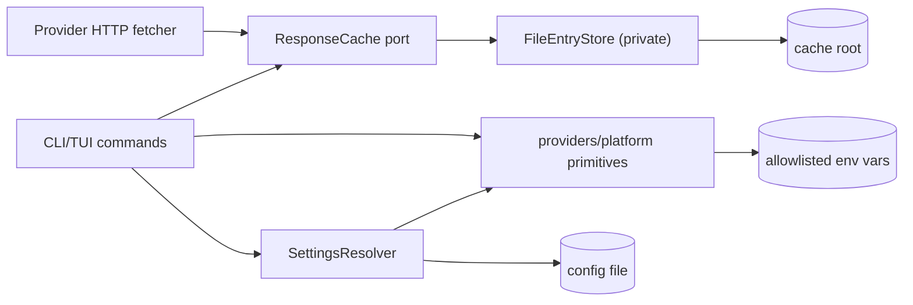

# Cache and Configuration Contract

Decision ticket: [GitHub issue #10 — Choose the cache and configuration
seam](https://github.com/FilthyS/book-title-lookup/issues/10)
Status: accepted baseline for implementation
Scope: `docs/architecture.md` cache and configuration rules plus the research
deliverables of issues #1, #2, and #5.

This document is the contract that later implementation tickets follow. It
defines the public and internal TypeScript surfaces, the on-disk envelope, key,
and path schema, and the behavior of the cache and configuration seams for raw
HTTP entries (fresh, stale, and negative), atomic replacement, schema and
decoder evolution, offline reads, inspection and clearing, configuration
precedence, permission failures, corruption, and concurrent processes. It also
defines the deterministic clock and filesystem seams and the fixture and
platform test matrix that keep those promises testable.

No production code was written for this ticket; the type declarations below are
reference contracts, not source files.

## 1. Purpose

Callers — provider HTTP fetchers, the offline gateway, CLI cache/config
commands, and the application composition root — must never reimplement
filesystem caching, HTTP freshness policy, directory discovery, environment
reading, or configuration precedence. This contract fixes one narrow seam for
each concern so that:

- Core never sees raw HTTP bodies, cache internals, filesystem paths, or
  environment variables;
- provider HTTP code does not know where entries live or how writes stay
  atomic;
- a future SQLite-backed cache can replace the file store without changing any
  caller;
- the TUI/CLI and Providers cannot drift on freshness, offline, or precedence
  rules;
- the permission manifest, the documented environment surface, and the code
  that reads the environment cannot drift.

## 2. Question

Issue #10 asks what interface and on-disk contract should hide raw HTTP
caching, fresh/stale/negative entries, atomic writes, schema evolution,
offline reads, cache inspection, cache clearing, configuration precedence, and
concurrent process behavior from callers. The answer is the seam architecture
and the exact contracts in Sections 5–18.

## 3. Constraints and groundwork

The contract is bound by accepted decisions, not invented here. It relies on:

- `docs/architecture.md`:
  - Providers owns raw HTTP response caching and platform configuration/cache
    locations; the TUI composition root owns configuration precedence;
    Core never imports Providers;
  - a cache port keeps a future SQLite implementation possible without changing
    domain code;
  - the cache stores raw successful or negative HTTP responses with normalized
    request identity, source, status, relevant headers, fetch time, freshness
    deadline, body, and decoder/schema version where needed;
  - the cache never stores a Resolved Work or final title recommendation;
  - the first implementation is one JSON file per hashed request identity in
    the platform cache directory; writes go to a temporary file and replace
    the target atomically;
  - offline mode may return stale entries; online mode may revalidate where the
    source supports useful cache validators; negative responses have a shorter
    TTL than successful detail records;
  - configuration precedence is CLI flag > environment variable > user config
    file > built-in default; secrets never appear in `config show`, logs, or
    example configuration;
  - normal tasks never use `-A`; permissions are per-name, per-host, and
    per-path.
- Issue #5 research (`docs/research/deno-persistence-and-permissions.md`),
  especially decisions **D1–D9**: platform directory table and the single
  `BOOK_TITLE_CACHE_DIR` override; the `providers/platform` locator; the atomic
  write procedure; the no-lock concurrency contract; the corruption contract;
  the closed environment allowlist; the run/test least-privilege baseline; and
  the compile-time dynamic-path limitation that issue #10 must record as a
  release decision.
- Issue #1 research (`docs/research/open-library-evidence-surface.md`):
  cache keys must include the full normalized request URL because search
  results depend on `fields`, `limit`, `offset`/`page`, and because the
  Editions endpoint depends on `offset`/`limit` per page; the cache must store
  raw status, content type, body, and `Location` for redirects; a 302 to a
  canonical Edition key is worth caching as an identifier-resolution map;
  freshness defaults are search 24 hours, detail 7 days, negative 1 hour; and
  offline mode needs previously cached Editions pages to reconstruct title
  groups because Work records carry no title/language evidence themselves.
- Issue #2 research (`docs/research/wikidata-retrieval-strategy.md`):
  cache raw Wikidata responses per endpoint with exact normalized request
  identity; never rely on upstream HTTP cache headers (`no-cache`/`private`
  and `cache-control` on entity responses are observed); keep the product TTL
  policy; WDQS server-side caching (~5 minutes) is a courtesy, not a cache
  contract; REST `ETag`/`Last-Modified` may later support revalidation but the
  MVP does not need a second decoder for that.
- `docs/product-spec.md` freshness defaults and the offline rule that stale
  entries are always labeled stale and never claimed fresh.

## 4. Content boundary

The seam caches **raw provider HTTP responses** only. It never caches:

- a Resolved Work, a reconciled Source Record, or a merged conclusion;
- a recommended Title Group or any Evidence Level;
- a suggested translation;
- domain objects of any kind.

```text
Cacheable          Not cacheable
-------------      -----------------------------------------------
raw status         Resolved Work
content type       reconciled Source Record
headers            recommended Title Group
body               Evidence Level
fetch time         suggested translation
freshness deadline query history
decoder version
negative marker
```

Corruption or loss of this cache therefore degrades to a refetch or a source
warning; it can never corrupt a bibliographic conclusion.

## 5. Seam overview

Two seams answer the issue's question.

1. **Response-cache seam** inside `packages/providers`. A caller-facing port,
   `ResponseCache`, plus a private file-store implementation,
   `FileEntryStore`. HTTP fetchers, the offline gateway, and CLI cache commands
   depend on the port. The port speaks cache outcomes and raw entry envelopes,
   never HTTP or bibliography types.
2. **Platform and configuration seam**. `providers/platform` owns directory
   discovery, directory security, path canonicalization and containment, and
   the closed environment allowlist. The TUI composition root owns
   precedence resolution through a `SettingsResolver` that consumes only those
   platform primitives, the config file located by them, and the parsed CLI
   flags. Every other caller receives an immutable `ResolvedSettings` value.



`Core` never appears in this diagram: cache and configuration concerns stop at
the Provider and application boundaries defined in `docs/architecture.md`.

## 6. Request identity and cache key

### 6.1 Canonical request identity

A cache key is derived from a **canonical request identity**, because upstream
responses differ by endpoint, host, format, language, and every query parameter
that selects fields or pagination.

```ts
type ProviderId = "open_library" | "wikidata";

interface CanonicalRequestIdentity {
  readonly provider: ProviderId;
  readonly method: "GET"; // the MVP issues no cacheable non-GET requests
  readonly url: string;   // canonical absolute URL, see rules below
}
```

Canonicalization rules for `url`:

1. Lowercase the scheme and authority.
2. Keep the path exactly as the provider client constructed it; do not
   percent-decode or re-encode path segments.
3. Sort query parameters by percent-encoded name, then by percent-encoded
   value, using bytewise order; decode no value before comparing.
4. Preserve every query parameter that can change the response meaning. Issue
   #1 evidence: Open Library search depends on `fields`, `limit`,
   `offset`/`page`, `q`/`title`, `author`, `isbn`, `language`, and `lang`;
   the Editions endpoint depends on `offset`/`limit`. Issue #2 evidence:
   Wikidata responses depend on `action`, `format`, `formatversion`, `search`,
   `language`, `strictlanguage`, `type`, `limit`, `continue`, `languages`,
   `props`, `redirects`, `srsearch`, and `srnamespace`. These must all remain
   in the canonical URL.
5. Drop nothing that is part of the request and nothing that is a documented
   response-shaping parameter. Drop only values that are provably inert for
   the response body and never secret material; in the MVP there is no such
   parameter, so the baseline keeps the full normalized URL.
6. Never store or hash authorization headers, cookies, or `User-Agent`
   content; the product sends no secrets in catalog requests.

### 6.2 Digest

```ts
interface CacheKey {
  readonly algorithm: "sha256";
  readonly digest: string; // 64 lowercase hex characters of SHA-256
  readonly identity: CanonicalRequestIdentity; // kept for inspection, never hashed
}

// digest = sha256(utf8(JSON.stringify(canonicalIdentity, sortedKeys)))
```

The digest is computed over the canonical identity serialized as compact JSON
with object keys in a fixed declaration order. Collisions between providers,
URLs, or request shapes are treated as corruption if they ever surface: the
envelope stores the full canonical URL and the store verifies that a loaded
entry's stored URL re-hashes to the file's key digest (Section 11).

Example:

```text
provider: "open_library"
url: https://openlibrary.org/search.json?fields=key%2Ctitle&limit=10&q=xxx
digest: 9f2b4c1d0a... (64 hex chars)
file: <cacheRoot>/v1/9f2b4c1d0a....json
```

## 7. On-disk schema

### 7.1 Roots

Roots come exclusively from the platform/config seam (Section 16). The
application directory name is `book-title-lookup`.

```text
configRoot = <platform config base>/book-title-lookup
cacheRoot  = <platform cache base>/book-title-lookup
```

Platform bases (accepted from issue #5 D1):

| OS | config base | cache base |
| --- | --- | --- |
| Windows | `%APPDATA%` | `%LOCALAPPDATA%` |
| macOS | `~/Library/Application Support` | `~/Library/Caches` |
| Linux/freedesktop | `$XDG_CONFIG_HOME` or `~/.config` | `$XDG_CACHE_HOME` or `~/.cache` |

`BOOK_TITLE_CACHE_DIR` (and a future CLI flag above it) overrides `cacheRoot`
entirely. Relative override values are invalid configuration.

### 7.2 Cache layout

```text
<cacheRoot>/
└── v1/
    ├── <digest>.json                 live entry envelope
    ├── <digest>.<random>.tmp         in-progress temp write (same directory)
    └── quarantine/
        └── <digest>.<epochMs>.<random>.json   quarantined entry
```

- `v1` names the on-disk envelope format generation. An incompatible envelope
  format in the future uses `v2`, so old and new entries never share a
  directory (Section 11).
- Live entry files are exactly `<digest>.json`; the digest is always 64
  lowercase hex characters, so filenames are bounded and Windows-safe.
- Temporary files live in `v1` next to the final file so the final `rename` is
  on one filesystem and cannot fail with a cross-device error.
- Quarantine lives beneath `v1` so quarantine moves are same-filesystem
  renames.

### 7.3 Envelope

One file is one entry. The envelope is versioned JSON:

```ts
type Instant = string; // ISO-8601 UTC with millisecond precision, e.g. "2026-09-05T12:34:56.789Z"

type EncodedBody =
  | { readonly encoding: "utf8"; readonly text: string }
  | { readonly encoding: "base64"; readonly base64: string };

interface RawResponseEnvelopeV1 {
  readonly envelopeVersion: 1;
  readonly key: {
    readonly algorithm: "sha256";
    readonly digest: string; // must equal hash of request below
  };
  readonly request: {
    readonly provider: ProviderId;
    readonly method: "GET";
    readonly url: string; // canonical URL actually requested
    readonly decoderSchemaVersion: number; // provider decoder version at fetch
  };
  readonly response: {
    readonly status: number;
    readonly contentType?: string; // value of Content-Type when present
    readonly location?: string;    // value of Location for 3xx entries
    readonly etag?: string;        // captured for future revalidation
    readonly lastModified?: string; // captured for future revalidation
    readonly body: EncodedBody;    // exact raw payload after transport decoding
  };
  readonly freshness: {
    readonly freshnessClass: "search" | "detail" | "negative";
    readonly negative: boolean;
    readonly fetchedAt: Instant;   // when the response was fetched
    readonly freshUntil: Instant;  // fetchedAt + TTL for its class, decided at write time
  };
}
```

Rules:

- `status`, `contentType`, and `body` reproduce what the decoder will consume.
  A 3xx entry keeps `location` and an empty or redirect body; issue #1 caches
  ISBN→Edition 302 redirects as an identifier-resolution map.
- Bodies are raw. If the payload decodes as UTF-8, store `encoding: "utf8"`;
  otherwise store the exact bytes as `base64`. This preserves the HTML 404
  bodies and any non-UTF-8 payload without pretending all HTTP is text.
- Only the allowlisted headers `content-type`, `location`, `etag`, and
  `last-modified` are promoted into the envelope. All other headers are
  dropped; secrets cannot leak into the cache by construction.
- `freshnessClass` and `negative` are written once by the writer from the
  endpoint policy (Section 9). `freshUntil` is `fetchedAt + TTL`, computed at
  write time by the same process and clock used for the fetch. Readers never
  recompute another writer's freshness.
- The envelope never stores a `stale` boolean. Staleness is derived at read
  time as `now >= freshUntil` using the clock seam. A persisted stale flag
  would silently rot between reads; persistence keeps authoritative timestamps
  only.

### 7.4 Config layout

```text
<configRoot>/
└── config.json
```

The config file is optional; absence is the built-in default, not an error.
The directory and file are never created implicitly by the MVP.

## 8. Response-cache port (public contract)

Callers depend on this interface. The MVP implementation is the private file
store; a future SQLite implementation provides the same surface.

```ts
type CacheMode = "online" | "offline";

interface CacheReadOptions {
  readonly mode: CacheMode;      // offline permits stale positive entries
  readonly signal?: AbortSignal;
}

type CacheReadOutcome =
  | { readonly status: "hit_fresh"; readonly envelope: RawResponseEnvelopeV1 }
  | { readonly status: "hit_stale"; readonly envelope: RawResponseEnvelopeV1; readonly staleSince: Instant }
  | { readonly status: "miss" }
  | { readonly status: "corrupt"; readonly quarantinedTo?: string }
  | { readonly status: "permission_denied"; readonly path: string }
  | { readonly status: "unsupported_environment" }
  | { readonly status: "cancelled" };

type CacheWriteOutcome =
  | { readonly status: "stored" }
  | { readonly status: "permission_denied"; readonly path: string }
  | { readonly status: "unsupported_environment" }
  | { readonly status: "cancelled" };

type CacheMutationOutcome =
  | { readonly status: "ok" }
  | { readonly status: "permission_denied"; readonly path: string }
  | { readonly status: "cancelled" };

interface CacheEntrySummary {
  readonly digest: string;
  readonly provider: ProviderId;
  readonly url: string;
  readonly status: number;
  readonly freshnessClass: "search" | "detail" | "negative";
  readonly state: "fresh" | "stale";
  readonly fetchedAt: Instant;
  readonly freshUntil: Instant;
  readonly byteLength: number;
}

interface ResponseCache {
  read(key: CacheKey, options: CacheReadOptions): Promise<CacheReadOutcome>;
  write(key: CacheKey, envelope: RawResponseEnvelopeV1, options?: { readonly signal?: AbortSignal }): Promise<CacheWriteOutcome>;
  list(): Promise<{ readonly status: "ok"; readonly entries: readonly CacheEntrySummary[] } | CacheMutationOutcome>;
  show(digest: string): Promise<{ readonly status: "ok"; readonly entry: RawResponseEnvelopeV1 } | CacheMutationOutcome>;
  remove(digest: string): Promise<CacheMutationOutcome>;
  clear(): Promise<{ readonly status: "ok"; readonly removedEntries: number; readonly removedBytes: number } | CacheMutationOutcome>;
  reclaim(): Promise<{ readonly status: "ok"; readonly removedTemps: number } | CacheMutationOutcome>;
}
```

Read semantics:

- A valid entry with `now < freshUntil` returns `hit_fresh` in either mode.
- A valid positive (non-negative) entry with `now >= freshUntil` returns
  `hit_stale` **only** in `offline` mode, and is always labeled with
  `staleSince`. In `online` mode a stale entry is a `miss`; the fetcher
  refetches and atomically replaces it. Online revalidation via
  `If-None-Match`/`If-Modified-Since` is a future additive method on this port
  and is not in the MVP.
- A **stale negative** entry never returns as a hit in any mode. Negative
  entries answer only while fresh; once expired they behave as `miss` and the
  store may delete them opportunistically on the read or during `reclaim()`.
- `corrupt` is returned after the store quarantines the offending file
  (Section 12); the caller treats it exactly like a miss plus a warning.
- `permission_denied`, `unsupported_environment`, and `cancelled` are typed and
  never masquerade as bibliographic results.

## 9. Freshness, negative entries, and TTL policy

Freshness is assigned by the writer at fetch time using the endpoint policy.
The freshness classes and the product defaults from `docs/product-spec.md`:

| Class | TTL | Typical endpoints (both providers) |
| --- | --- | --- |
| `search` | 24 hours | OL `/search.json`; WD `wbsearchentities`, `list=search` |
| `detail` | 7 days | OL `/works/*.json`, `/books/*.json`, `/works/*/editions.json` pages, `/isbn/*.json` redirects; WD `wbgetentities`, `Special:EntityData`, fixed SPARQL results |
| `negative` | 1 hour | Definitive absence only (below) |

An entry is marked `negative` when the response is a definitive absence for
the exact canonical request:

- HTTP 404/410 for a missing key, ISBN, or entity (OL JSON 404, OL unknown-ISBN
  HTML 404, WD absent entity);
- an empty result set that the endpoint reports as a successful no-result (OL
  `numFound: 0` with an empty `docs` array; WD zero search/query rows).

Not negative:

- client-validation errors such as OL's 422 for an over-short `q` (they signal
  an invalid request from the caller; architecture forbids retrying ordinary
  4xx and the caller should not repeat the same bad request);
- transport errors, timeouts, 429, and 5xx (these are never cached at all;
  they are retried or surfaced by the HTTP layer, issue #8 scope);
- redirects (`302`/`301`): a redirect is a positive detail-class entry whose
  body is the `Location` map, per issue #1.

Offline mode may use stale positive `search` and `detail` entries and must
label them stale at the point of use. It never uses a stale negative entry to
claim absence. A fresh negative entry may be used in offline mode within its
one-hour TTL.

## 10. Atomic replacement

Accepted from issue #5 D3. Each write to a final `<digest>.json`:

1. create a unique temporary file **in the same directory** (`v1`) with
   `Deno.makeTempFile`-equivalent naming (`<digest>.<random>.tmp`);
2. write the complete serialized envelope;
3. flush with `Deno.FsFile.sync` (or `syncData`) before closing;
4. close;
5. replace the target with `Deno.rename(temp, final)`;
6. on Windows, retry a transient rename failure with bounded jitter because a
   local antivirus or indexer may briefly hold the destination.

Guarantees:

- a reader sees either the complete previous entry or the complete new entry;
- a process crash before the rename leaves only an orphaned temp file, which
  `reclaim()` removes when old;
- a process crash after the rename leaves the complete new entry;
- the final path may be missing after sudden power loss on some filesystems;
  that is a cache miss and a refetch, never a bibliographic error;
- Windows does not promise POSIX-style never-missing visibility; readers
  open, read the small JSON entry fully, and close promptly, and treat a
  transient missing final path as a miss.

## 11. Schema and decoder evolution

Two version numbers evolve independently.

- `envelopeVersion` names the shape of the JSON wrapper (currently `1`).
  Additive changes that old readers can safely ignore are permitted within a
  version. Incompatible wrapper changes require a new `v{n}` directory under
  `cacheRoot`; old files are never migrated in place, and a reader that finds
  an entry whose `envelopeVersion` it cannot read quarantines it as corrupt.
- `request.decoderSchemaVersion` names the provider decoder/schema version that
  interprets the raw body. Every change that can alter how a stored raw body
  is interpreted bumps it; purely additive decoder tolerance does not. When a
  stored entry's `decoderSchemaVersion` differs from the current provider
  version, the body cannot be trusted and the entry is quarantined as corrupt
  on read.

Verification on every read, before anything is returned:

1. the file parses as JSON;
2. `envelopeVersion` is supported;
3. the stored canonical request re-hashes to the file's digest (the file name
   matches its content);
4. `request.decoderSchemaVersion` equals the caller's current decoder schema
   version;
5. `freshness` fields are well-formed and internally consistent
   (`freshUntil >= fetchedAt`);
6. the body is decodable per its declared `encoding`.

Any failure is corruption (Section 12). This guarantees that an old cache can
never feed a new decoder a body the decoder was not written to interpret, and
that reconciled conclusions stored by older releases can never poison later
releases because reconciled conclusions are not cached at all.

## 12. Corruption

Corruption is an entry whose JSON cannot be parsed, whose version is
unsupported, whose digest does not match its content, whose freshness fields
are inconsistent, or whose body cannot be decoded. Policy (issue #5 D5):

1. A corrupted entry is a **cache miss**, never a fallback or a fabricated
   conclusion.
2. The store moves the file into `v1/quarantine/` (renaming with epoch plus
   random so it cannot collide), or deletes it if the move fails.
3. The read returns `corrupt`; the caller emits a source warning and refetches
   when online, or reports the ordinary no-usable-cache outcome when offline.
4. Quarantined files remain on disk beneath `v1/quarantine/` for inspection
   and are removed by `cache clear`; `reclaim()` also removes expired negative
   entries and stale temporary litter.

## 13. Concurrent processes and races

Accepted from issue #5 D4. There are **no advisory locks, lock files, lock
directories, or PID files**.

- **In-process**: provider composition keeps an in-memory table of in-flight
  requests keyed by `digest`; concurrent requests for the same identity share
  one fetch/write.
- **Cross-process**: no mutual exclusion is attempted. Each write is a
  whole-file atomic rename; every final state is one complete entry from one
  writer. The contract is **last-complete-writer wins**.
- Writers never read-modify-write an existing entry; they always write a whole
  new envelope and rename. This makes concurrent success/success and
  success/negative races benign: the final file is one complete raw response.
- Readers open, read, and close; a rename during a read does not invalidate
  the data already read.
- Write operations from one process are serialized through a small per-process
  queue so temp creation and rename never overlap from the same process. The
  seam does not claim cross-process serialization.
- Freshness is never recomputed on behalf of another writer; `freshUntil` is
  set by the writer that fetched the response.

## 14. Offline behavior

Offline mode is a resolved setting (`ResolvedSettings.offline === true`) or a
CLI flag above it. Callers never decide freshness themselves.

| Situation | Outcome |
| --- | --- |
| Fresh positive or fresh negative entry | usable; not labeled stale |
| Stale positive entry | usable in offline mode only; labeled stale at the point of use; stale Edition pages and search pages are what let offline mode reconstruct title groups, per issue #1 |
| Stale negative entry | never usable; equivalent to miss |
| No entry, or only corrupt entries, offline | no usable cached entry; source-level partial/failed outcome with a distinct warning |
| Fresh search page present but Edition expansion pages absent | return what the cache proves; warn about the missing expansion |

The offline gateway (provider HTTP composition) routes all reads through
`ResponseCache.read(..., { mode: "offline" })` and passes envelopes to
decoders; it does not implement freshness math itself.

## 15. Inspection and clearing commands

Product behavior — users can inspect and clear the cache, and `config show`
exists — is backed by port operations, never by direct filesystem access in the
UI. Command shape and JSON rendering are owned by the CLI/TUI tickets; this
contract fixes the operations and their guarantees.

| Command | Port operation | Guarantees |
| --- | --- | --- |
| cache inspection (`cache list`, `cache show <digest>`) | `list()`, `show(digest)` | metadata listing is deterministic (sorted by digest); `show` returns the full envelope to the command layer, which prints the raw body only when explicitly requested (e.g., `--debug`); output always redacts anything sensitive and never includes secrets by construction |
| cache clearing (`cache clear`) | `clear()` | removes live entries, quarantined files, and temp litter beneath `v1`; returns counts; never touches `configRoot` |
| startup reclamation | `reclaim()` | removes temp files older than the reclamation threshold and expired negative entries; safe with live writers because young temps are never deleted |
| config inspection (`config show`) | `SettingsResolver` diagnostics | prints effective settings with their origin (`cli`/`environment`/`config_file`/`default`); never prints reserved or future secrets |

`cache clear` never deletes the config file or any directory root, and never
touches files outside the two resolved roots. Both commands operate only
through the seams; a caller cannot bypass path containment checks.

## 16. Configuration seam

### 16.1 Environment allowlist

One exported constant names every environment variable any code may read. The
permission manifest for `deno run`, tests, and compile flags is derived from
the same constant so runtime reads and grants cannot drift (issue #5 D6, D7).

```ts
const ENV_ALLOWLIST = [
  // product settings, MVP
  "BOOK_TITLE_CONTACT",
  "BOOK_TITLE_CACHE_DIR",
  "BOOK_TITLE_OFFLINE",
  "BOOK_TITLE_LOG_LEVEL",
  // platform discovery
  "HOME",
  "XDG_CONFIG_HOME",
  "XDG_CACHE_HOME",
  "LOCALAPPDATA",
  "APPDATA",
  "USERPROFILE",
] as const;
```

`BOOK_TITLE_GOOGLE_API_KEY` is a documented reserved name but is **not** in the
allowlist until the Google adapter exists; the allowlist and the documented
variable list change together. Reads use only `Deno.env.get(name)`; never
`Deno.env.toObject()`.

### 16.2 Config file

```ts
interface UserConfigFileV1 {
  readonly schemaVersion: "config.v1";
  readonly offline?: boolean;
  readonly logLevel?: "debug" | "info" | "warn" | "error";
  readonly contact?: string; // contact used in the User-Agent when provided
}
```

Rules:

- The file lives at `<configRoot>/config.json`. Unknown keys are rejected as
  invalid configuration so typos cannot silently no-op; `schemaVersion` is
  required.
- **Directory roots are never read from the config file.** Roots come from the
  platform defaults plus `BOOK_TITLE_CACHE_DIR`/a future CLI flag; reading
  roots from the config file would create a circular dependency during config
  discovery (issue #5).
- The file is read once at process start, parsed, and kept immutable for the
  process lifetime.

### 16.3 Resolved settings

```ts
type SettingSource = "cli" | "environment" | "config_file" | "default";

interface ResolvedSettings {
  readonly configRoot: string; // absolute, canonical
  readonly cacheRoot: string;  // absolute, canonical
  readonly offline: boolean;
  readonly logLevel: "debug" | "info" | "warn" | "error";
  readonly contact?: string;
  readonly sources: {
    readonly offline: SettingSource;
    readonly logLevel: SettingSource;
    readonly contact: SettingSource;
    readonly cacheRoot: SettingSource; // "cli" | "environment" | "default" only
  };
}
```

Precedence, accepted from `docs/architecture.md`:

```text
CLI flag > environment variable > user config file > built-in default
```

Applied per setting. `cacheRoot` is special: only CLI flag, environment, or
default can select it because roots never come from the config file. The
resolver hides all of this; consumers receive an immutable value with origin
information for diagnostics. `config show` prints these origins.

Platform environment variables (`HOME`, `XDG_*`, Windows AppData variables)
are inputs to the default category only; they never masquerade as product
settings and are resolved once at process start.

### 16.4 Typed resolution failures

Settings resolution returns typed failures, never thrown strings:

- `invalid_config` — unreadable JSON, wrong `schemaVersion`, unknown key, or
  invalid value;
- `permission_denied` — an allowlisted variable or the config/cache path was
  denied by the process permission grant;
- `unsupported_environment` — the active platform produced no usable root
  (for example Windows with neither `LOCALAPPDATA` nor derivable
  `USERPROFILE`);
- `cancelled` — abort before the value was needed.

The CLI maps these to the documented configuration/permission diagnostics and
exit-code classes; they are never reported as book outcomes.

## 17. Permission failures

Deno granular grants are the primary least-privilege boundary (issue #5 D7):

- `deno run`, tests, and CI grant exactly the allowlisted environment names,
  the catalog hosts, and the two resolved fixture roots.
- Runtime permission errors surface as typed seam failures
  (`permission_denied` for cache/file operations and settings, `cancelled` for
  aborts), never as stack traces or fabricated results.

For `deno compile`, the prebuilt binary cannot know the end user's runtime
computed profile directory at compile time, and Deno 2.9 documents no
runtime-scoped path grant for compiled executables (issue #5 D9). This ticket
records the accepted release decision for issue #10:

- **Release decision (baseline)**: compiled artifacts keep narrow
  environment (allowlist) and network (catalog hosts) grants. The filesystem
  grant is the documented broad compile-time filesystem grant, constrained at
  runtime by the sealed seams: every file operation is re-canonicalized and
  verified beneath one of the two resolved roots before it touches the disk.
  No artifact ever uses `-A`-style unrestricted environment or network grants.
- **Revisit trigger**: if Deno documents runtime-scoped path grants, path
  placeholders, or path denial lists for compiled executables, distribution
  moves to exact per-path grants and this release decision is revised.

Self-compiled builds and source execution keep exact per-path grants.

## 18. Deterministic seams

Freshness, staleness, TTL expiry, temp naming, quarantine naming, and Windows
rename-retry jitter are the only time- or randomness-dependent behaviors. They
are isolated behind three narrow seams so every fixture test is deterministic.

```ts
interface Clock {
  now(): Instant; // sole source of "now" for the cache and settings seams
}

interface FileSystemSeam {
  // same-directory temp creation, write, flush, close, rename,
  // remove, stat, scan-directory, and move-into-quarantine operations
  // used by FileEntryStore. Defaults delegate to Deno; fixtures inject a
  // memory or temp-directory implementation.
}

interface RandomSource {
  // non-cryptographic uniqueness for temp/quarantine names and jitter;
  // fixtures inject a fixed sequence.
}
```

Responsibilities:

- `Clock` drives `freshUntil` computation, staleness derivation, the stale
  threshold for temp reclamation, and revalidation timing when that lands.
- `FileSystemSeam` lets crash, contention, and atomicity fixtures run without a
  real filesystem race or antivirus.
- `RandomSource` makes temp/quarantine names and rename-retry jitter
  deterministic under test.

Production wiring: real `Clock` (UTC clock), real `FileSystemSeam` over Deno,
and a secure random source. Fixtures override each.

## 19. Fixture and platform test matrix

Fixture-backed only; no live sources, no real user profile directories. Each
test sets only allowlisted environment variables before process start and
grants exactly those names plus the fixture roots.

| # | Case | Assertion | Deterministic seams used | Platforms |
| --- | --- | --- | --- | --- |
| 1 | Default roots | Linux `XDG_*`/`~/.config`+`~/.cache`; macOS `~/Library/Application Support`+`~/Library/Caches`; Windows `%APPDATA%`+`%LOCALAPPDATA%`; each with `/book-title-lookup` | — | Linux, macOS, Windows |
| 2 | Cache override | `BOOK_TITLE_CACHE_DIR` wins over platform default; relative override rejected as `invalid_config` | — | all |
| 3 | Precedence | CLI > env > config file > default per setting; origins reported; `cacheRoot` never from config file | — | all |
| 4 | Unsupported environment | Missing required platform var yields `unsupported_environment`, never a silent fallback | — | all |
| 5 | Directory security | Roots created `0o700` (POSIX), existing dirs untouched, operations beneath canonical roots, `..`/prefix-sibling paths rejected | FileSystemSeam | all |
| 6 | Key identity | Query parameters that shape responses (`fields`, `limit`, `offset`/`page`, `language`, `format`, `props`, `continue`) produce distinct keys; param order does not | — | all |
| 7 | Envelope round-trip | UTF-8 and base64 bodies, redirect entries with `location`, HTML and JSON content types, store/read whole | FileSystemSeam | all |
| 8 | Freshness classes | search 24 h, detail 7 d, negative 1 h decided at write from injected clock | Clock | all |
| 9 | Stale positive offline | stale positive returns `hit_stale` with `staleSince` only in offline mode; label present | Clock | all |
| 10 | Stale positive online | online mode treats stale as `miss` (refetch path) | Clock | all |
| 11 | Stale negative | expired negative never returns a hit in any mode | Clock | all |
| 12 | Atomic replacement | concurrent readers see whole old or whole new entry; no partial content; no missing-name window asserted on Windows | FileSystemSeam | all; Windows semantics separately |
| 13 | Crash simulation | Kill a writer at random intervals; final entry is old-complete or new-complete; orphan temp reclaimed on next `reclaim()` | FileSystemSeam, RandomSource | Linux, Windows |
| 14 | Windows rename contention | A helper holds an entry open without delete sharing; writer retries with bounded jitter and eventually succeeds | FileSystemSeam, RandomSource | Windows |
| 15 | Cross-process races | N processes write same and distinct keys; every final entry parses whole; last-complete-writer-wins observable | FileSystemSeam | all |
| 16 | Corruption recovery | Truncated, garbage, wrong `envelopeVersion`, digest mismatch, wrong `decoderSchemaVersion`, inconsistent freshness → `corrupt`, quarantine, miss, refetch online; distinct warning offline | FileSystemSeam | all |
| 17 | Decoder evolution | decoder schema bump invalidates stored bodies of the old version; additive decoder changes do not | — | all |
| 18 | Offline assembly | stale Edition page + stale search page reconstruct title groups offline and are labeled; missing expansion pages warn | Clock | all |
| 19 | Inspect/clear | `list` deterministic, `show` full envelope, `clear` removes entries+quarantine+temps and never touches `configRoot` | FileSystemSeam | all |
| 20 | Env allowlist | Process granted only allowlisted names succeeds; an unlisted or denied variable maps to `permission_denied`, never `toObject()` | — | all |
| 21 | Least privilege | Fixture process with exact grants succeeds; denied cache path maps to typed failure | — | all |
| 22 | Compile smoke | Compiled artifact starts, resolves fixture roots via allowlist env, maps missing permissions to structured output | — | per target (Linux/macOS/Windows) |

No matrix row asserts POSIX-equivalent atomic visibility on Windows, and no
row requires live network access.

## 20. Decisions

These are the durable outcomes of issue #10.

- **10-D1 Raw-only boundary**: the cache stores raw provider HTTP responses
  only; reconciled Works, recommendations, and domain objects are never
  cacheable (Section 4).
- **10-D2 Seam placement**: Providers exposes one `ResponseCache` port backed
  by a private `FileEntryStore`; `providers/platform` owns roots, environment
  allowlist, and containment; the TUI composition root owns precedence via a
  `SettingsResolver`; Core sees none of it (Sections 5, 8, 16).
- **10-D3 Key schema**: keys are SHA-256 digests over a canonical
  provider+method+URL identity that preserves every response-shaping
  parameter; filenames are `<digest>.json` under `<cacheRoot>/v1` (Sections 6,
  7).
- **10-D4 Envelope schema**: one versioned JSON envelope per file holding
  request, response status/type/body/allowlisted headers, freshness metadata,
  negative marker, and decoder schema version; no stored stale boolean
  (Section 7.3).
- **10-D5 Freshness policy**: search 24 h, detail 7 d, negative 1 h assigned at
  write time; stale positives usable offline only and labeled; stale negatives
  never usable (Sections 9, 14).
- **10-D6 Atomicity**: same-directory temp, write, flush, close, rename, with
  bounded Windows rename retry; no advisory locks; last-complete-writer-wins
  cross-process (Sections 10, 13).
- **10-D7 Evolution**: `envelopeVersion` guards wrapper shape; incompatible
  wrappers move to a new `v{n}` directory; `decoderSchemaVersion` guards body
  interpretation; mismatches are corruption (Section 11).
- **10-D8 Corruption**: corrupt = miss + quarantine + refetch/warn; never a
  fallback to fabricated evidence (Section 12).
- **10-D9 Commands**: inspection and clearing run through the port, respect
  containment, and never touch the config root or the other directory
  (Section 15).
- **10-D10 Config precedence**: CLI > env > config file > default, per setting,
  with origins retained for diagnostics; roots never come from the config file;
  `BOOK_TITLE_CACHE_DIR` is the single product cache override (Section 16).
- **10-D11 Compile permissions**: prebuilt binaries keep narrow environment and
  network grants with the filesystem footprint enforced by the sealed seams;
  revisit when Deno documents runtime-scoped path grants (Section 17).
- **10-D12 Determinism**: clock, filesystem, and randomness are injectable
  seams so freshness, atomicity, and crash fixtures are deterministic
  (Section 18).

## 21. Explicit non-choices

- No advisory locks, lock files, lock directories, or PID files anywhere in
  the file-store implementation (issue #5 D4).
- No SQLite in the MVP; the port is the migration point (issue #5).
- No reliance on upstream HTTP cache headers (`Cache-Control`, `Expires`,
  `ETag` based freshness) for decision-making; they are observed and ignored
  except that `etag`/`last-modified`/`location`/`content-type` are captured for
  future revalidation and decode purposes (issue #2).
- No second decoder or revalidation path in the MVP; that is a future additive
  port method.
- No caching of client-validation errors, transport errors, or 5xx.
- No storing of raw header maps, cookies, authorization material, or
  `User-Agent` content in the cache.
- No config file creation, no cache-dir setting inside the config file, and no
  reading of directory roots from any file.

## 22. Residual risks and revisit triggers

- **Compile-time dynamic path grants**: revisited per 10-D11 when Deno
  documents path placeholders, runtime path grants, or path denial lists for
  compiled executables.
- **Directory-entry durability after power loss**: a lost final rename is a
  cache miss and refetch; bounded by design.
- **Windows replacement semantics**: antivirus/indexer contention may delay
  renames; the bounded retry budget may need tuning on real Windows hardware.
- **Key canonicalization drift**: if a provider client ever emits two textual
  forms for one logical request, they will cache as two keys. Fixture row 6
  and request-construction tests in issue #8 guard against this.
- **Decoder-version discipline**: 10-D7 depends on providers bumping
  `decoderSchemaVersion` on every interpretation-changing decoder change;
  issue #8 owns that discipline.
- **@std drift**: if `@std/fs` later documents an atomic-write helper covering
  write, flush, and replace, the file store may adopt it without changing the
  port.
- **Future revalidation**: conditional requests can be added as a new port
  method without changing existing callers.

## 23. References

Primary contracts this document implements or refines:

- `docs/architecture.md` (cache, configuration, permissions, CLI)
- `docs/product-spec.md` (cache and offline behavior, freshness defaults)
- Issue #5 research: `docs/research/deno-persistence-and-permissions.md`,
  decisions D1–D9
- Issue #1 research: `docs/research/open-library-evidence-surface.md`,
  Issue #10 section
- Issue #2 research: `docs/research/wikidata-retrieval-strategy.md`,
  Issue #10 section
- Issue tracker governance: `docs/agents/issue-tracker.md`

Platform and runtime citations for the claims above are recorded in the issue
#5 research references (Deno runtime/API manuals, `@std/fs`, freedesktop XDG,
Microsoft Known Folders/`MoveFileExW`/`ReplaceFileW`/`CreateFileW`, POSIX
`rename`, and Apple File System Programming Guide), retrieved 2026-09-05.
