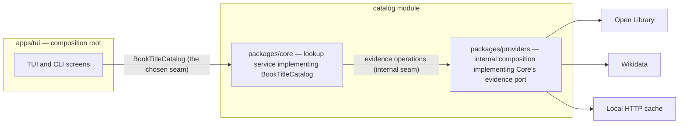

# Catalog Module Interface

Decision ticket: [GitHub issue #6 — Choose the catalog module
interface](https://github.com/FilthyS/book-title-lookup/issues/6)

Type: grilling
Status: design decision for issue #6
Blocked by: #1 (Open Library evidence surface), #2 (Wikidata retrieval
strategy); their research reports are listed under References.

## Decision

The application calls one deep, provider-neutral interface named
`BookTitleCatalog` with exactly three operations — `search`, `resolve`, and
`findTitles` — owned by `packages/core` and consumed only by `apps/tui`, the
TUI and CLI application package. The seam sits at the top of the Core lookup
service, not at the provider layer.

Everything below that seam is implementation detail of the catalog module:

- per-source Open Library and Wikidata adapters;
- request fan-out, per-source deadlines, and partial-failure aggregation;
- provider orchestration for direct and indirect resolution;
- evidence reconciliation, classification, title grouping, and
  deterministic recommendation.

The MVP does not expose a public plugin API. There is no third-party
`BookProvider` interface; Open Library and Wikidata do not share enough
semantics to justify one before real implementations exist. The module
interface is a product use-case contract for the presentation layer, and the
provider-facing seams inside the workspace are internal product seams that may
change freely during the first vertical slice.

This document records the decision and the concrete readonly TypeScript
contracts, ownership boundaries, invariants, and test seams. It specifies no
production implementation; package scaffolding and code land under issue #14
after the evidence tickets (#7, #8, #10) resolve.

## Why the seam exists

`docs/architecture.md` separates bibliographic policy from terminal rendering
and external API shapes:

- Core owns the domain model, the use cases, expected outcome types, and the
  ports the provider composition must satisfy. Core never calls `fetch`,
  reads configuration, or imports Providers.
- Providers owns Open Library and Wikidata clients, decoding and validation,
  redirect handling, HTTP caching, and the federated composition that
  implements Core's ports. Providers may import Core contracts; Core never
  imports Providers.
- The TUI is the composition root. It builds Providers and the catalog
  service and then talks to the catalog service only.

The question in issue #6 is where the seam the application calls should sit
so that source heterogeneity, reconciliation, partial failure, cancellation,
and testing remain local. The answer is the boundary between the presentation
layer and the Core lookup service: a small, deep module surface whose three
operations mirror the product workflow (search candidates, confirm the Work,
read its attested titles), with the pipeline complexity kept underneath.

## Requirements the interface must meet

1. Provide search, resolution, and title lookup as source-neutral operations.
2. Keep provider heterogeneity local: no Open Library, Wikidata, ISBN-route,
   or SPARQL shape ever appears in the application contract.
3. Keep reconciliation local: candidate assembly, cross-source reconciliation,
   indirect-resolution decisions, evidence classification, grouping, and
   recommendation never become the caller's job.
4. Represent partial failure as data: per-source warnings on otherwise valid
   results, and explicit failures only when an outcome cannot be produced.
5. Represent cancellation as a first-class outcome, not as a thrown exception.
6. Let testing stay local: fakes at the module seam drive TUI/CLI tests,
   fakes at the internal provider seam drive Core tests, and fixture-backed
   contract tests drive Providers.
7. Avoid a premature public plugin interface.
8. Keep the surface as small as possible while remaining deep enough that
   callers never reach behind it.

## Candidate seams

### Option A — Deep application seam (chosen)

The seam sits between the presentation/composition layer and the Core lookup
service. The application calls `BookTitleCatalog` with `search`, `resolve`,
and `findTitles`. A composition root wires the concrete provider composition
into the Core service at startup.

- Visible surface: three operations plus their query, reference, outcome, and
  warning types.
- Provider heterogeneity: fully internal, behind the composition port.
- Reconciliation: internal to Core, below the seam.
- Partial failure: surfaced only as outcome statuses plus warnings/failures.
- Cancellation: one request-options convention for the whole module.
- Testing: TUI tests fake the seam; Core tests fake the internal composition
  port; Providers contract-test their adapters and composition.
- Plugin risk: none; there is nothing for a third-party provider to implement.

### Option B — Source-adapter or plugin seam (rejected)

The seam sits between application logic and each catalog source. Either the
application calls a generic per-source `BookProvider` interface, or it calls
Open Library and Wikidata adapters directly and reconciles results itself.

Rejected because:

- Open Library and Wikidata model Works and Editions differently, use
  different identifiers, and expose different discovery strengths (research
  #1 and #2). Forcing them behind one generic provider contract either leaks
  their differences upward or invents a lowest-common-denominator surface that
  no source implements cleanly.
- Orchestration, cross-source deduplication, indirect resolution, and
  partial-failure bookkeeping would move into the application layer, which
  architecture assigns to Core.
- It is a public plugin API in all but name: the moment the application
  depends on a general `BookProvider`, that contract must be stabilized before
  any real heterogeneous implementations prove it, and Google Books or another
  future source becomes a compatibility obligation.
- The TUI would need doubles for every source in every flow, making tests
  wider and more brittle than the module-level fake.

### Option C — Evidence-operation seam exposed to the caller (rejected)

The seam exposes the four evidence-oriented operations the sources actually
support — candidate search, identifier resolution, Work-to-Edition expansion,
and edition title evidence — as the application contract, leaving the caller
to compose them into the lookup pipeline.

Rejected because:

- The caller would implement the product workflow itself. The "title lookup"
  the product defines (resolve → expand → attest → classify → group) would
  have to be rebuilt on every call site, and reconciliation would again live
  above the seam.
- It is more operations, not fewer: the opposite of the smallest deep
  surface. The deep three-operation surface is what the product workflow
  actually needs.
- The research reports recommend those evidence operations as the *source
  model* a catalog composition must support (see the internal-seam section
  below), not as the application-facing contract.

## Option comparison

| Criterion | A: deep application seam | B: source/plugin seam | C: evidence-op seam |
| --- | --- | --- | --- |
| Visible operations | 3 (search, resolve, findTitles) | per-source adapter methods | 4 evidence operations |
| Provider heterogeneity | hidden in module | leaks to caller | leaks to caller |
| Reconciliation location | Core, under seam | caller or app layer | caller or app layer |
| Partial failure locality | module outcomes | caller must aggregate | caller must aggregate |
| Cancellation convention | one RequestOptions | per adapter, or caller invents one | per operation |
| Test seam size | one module fake for UI | many source fakes | many source fakes plus a pipeline |
| Public plugin API risk | none | high | medium |
| Matches product workflow | yes | no | no |

## Chosen seam in context



Dependencies still run in the direction the architecture describes: Providers
imports Core contracts; Core never imports Providers; the TUI composes both and
then calls the Core service. The arrow between the TUI and Core is the seam
this document fixes.

The application interface contract lives in Core and is the stable language of
the whole product boundary. The internal evidence port that Providers
implements also lives in Core (so Providers can implement it), but it is a
workspace-internal contract: Providers is not a third-party plug-in surface,
and ticket #8 may refine that port without touching the application seam.

## Application interface contracts

The following TypeScript is the concrete contract for the chosen seam.
Everything is readonly; arrays are immutable; no source-specific type crosses
the boundary. File paths are illustrative — the workspace packages are
scaffolded under issue #14.

```ts
// packages/core/src/catalog/module.ts  (illustrative placement)

// ---------------------------------------------------------------------------
// Queries and options
// ---------------------------------------------------------------------------

/** BCP-47-style language tag in canonical module form, e.g. "zh", "zh-Hans",
 *  "ja", "en". The module normalizes input tags and maps provider encodings
 *  internally. */
type LanguageTag = string;

/** Search input exactly as the user supplied it. Fields are raw user text;
 *  the module performs normalization. */
interface BookQuery {
  /** Title text (Chinese in the MVP). Required; never empty or whitespace. */
  readonly title: string;
  /** Optional author or responsible creator. */
  readonly author?: string;
  /** Optional ISBN in any normal user form; the module normalizes it. */
  readonly isbn?: string;
  /** Optional publication year as typed by the user. */
  readonly publicationYear?: number;
}

/** Filters for the title-lookup phase. */
interface TitleQuery {
  /** Requested result languages. An empty array means all discovered
   *  languages. Unknown-language evidence never satisfies a requested
   *  language. */
  readonly targetLanguages: readonly LanguageTag[];
}

/** Options shared by every module operation. */
interface RequestOptions {
  /** Cancellation signal. When aborted, the operation stops promptly and its
   *  promise resolves to the operation's `{ status: "cancelled" }` outcome.
   *  Cancellation never rejects and never reports `failed`. */
  readonly signal?: AbortSignal;
}
```

```ts
// ---------------------------------------------------------------------------
// Opaque references
// ---------------------------------------------------------------------------

/** Opaque handle to one Work Candidate returned by `search()`. Callers store
 *  and return it; they never parse or construct it. Valid only while the
 *  candidate response that produced it is the active one. */
declare const candidateRefBrand: unique symbol;
type CandidateRef = string & { readonly [candidateRefBrand]: typeof candidateRefBrand };

/** Opaque handle to the Resolved Work returned by `resolve()`. Callers pass
 *  it to `findTitles()` for the rest of the session or until it is replaced. */
declare const resolvedWorkRefBrand: unique symbol;
type ResolvedWorkRef = string & { readonly [resolvedWorkRefBrand]: typeof resolvedWorkRefBrand };

/** Reference namespaces the module can act on. New namespaces are added only
 *  when a source that uses them enters the composition. */
type ExternalReferenceNamespace =
  | "openlibrary:work"
  | "openlibrary:edition"
  | "wikidata:item"
  | "isbn";

/** Stable, namespaced identifier from an upstream catalog or the ISBN
 *  system. Unlike the opaque refs above, External References are first-class
 *  values: they may be displayed, stored, and reused across responses. */
interface ExternalReference {
  readonly namespace: ExternalReferenceNamespace;
  /** Canonical value, e.g. "OL274505W", "Q178869", "9780140328721". */
  readonly value: string;
}

/** What `resolve()` may be asked to confirm. */
type ResolveTarget =
  | { readonly kind: "candidate"; readonly ref: CandidateRef }
  | { readonly kind: "externalReference"; readonly reference: ExternalReference };
```

```ts
// ---------------------------------------------------------------------------
// Payload and outcome types
// ---------------------------------------------------------------------------

/** Built-in sources that can produce warnings and failures. */
type SourceId = "openlibrary" | "wikidata";

/** Structured reason for a source-level warning or failure. Codes carry
 *  machine meaning; presentation layers render them. */
type SourceIssueCode =
  | "unavailable"    // source could not be reached or failed as a whole
  | "timeout"        // source exceeded its deadline
  | "rate_limited"   // source throttled and retry budget was exhausted
  | "decode"         // upstream payload did not match its documented shape
  | "conflict"       // records or claims conflict internally and were kept apart
  | "stale";         // only stale cached evidence was usable

interface SourceIssueBase {
  readonly source: SourceId;
  readonly code: SourceIssueCode;
  /** Optional structured facts (record keys, request identity, counts).
   *  Never a completed English sentence. */
  readonly details?: Readonly<Record<string, string>>;
}

/** Degradation on an otherwise valid outcome. */
interface SourceWarning extends SourceIssueBase {}

/** Why an outcome could not be produced. */
interface SourceFailure extends SourceIssueBase {}

/** A Work Candidate offered for user confirmation. Field content beyond the
 *  refs is the evidence contract of ticket #7; only the shape below is fixed
 *  here. */
interface WorkCandidate {
  readonly ref: CandidateRef;
  /** Strong references bound to this candidate (Open Library Work key,
   *  Wikidata item, ...). */
  readonly references: readonly ExternalReference[];
  /** Source-neutral facts the caller may render while asking the user to
   *  confirm or reject this candidate. */
  readonly summary: CandidateSummary;
}

/** Source-neutral presentation facts. Final field semantics land in #7. */
interface CandidateSummary {
  /** Best display title for the candidate. */
  readonly title: string;
  /** Other recorded titles and matched forms, when useful. */
  readonly alternativeTitles?: readonly string[];
  readonly authors?: readonly string[];
  readonly publicationYear?: number;
  readonly editionCount?: number;
  readonly contentLanguages?: readonly LanguageTag[];
}

/** A Work whose identity has been confirmed by a strong reference or by the
 *  user. Content beyond the refs is finalized by ticket #7. */
interface ResolvedWork {
  readonly ref: ResolvedWorkRef;
  /** Strong references bound to the Resolved Work. */
  readonly references: readonly ExternalReference[];
  /** Source-neutral facts the caller may display. */
  readonly summary: ResolvedWorkSummary;
}

interface ResolvedWorkSummary {
  readonly title: string;
  readonly authors?: readonly string[];
  readonly firstPublicationYear?: number;
  readonly contentLanguages?: readonly LanguageTag[];
}

/** A language- and title-normalized result group returned by title lookup.
 *  Grouping, evidence levels, and attestation content are ticket #7's
 *  domain contract; the name is fixed here because the outcome carries it. */
interface TitleGroup {
  readonly language: LanguageTag | null;
  readonly displayTitle: string;
  readonly evidenceLevel: "verified" | "probable" | "ambiguous";
}
```

```ts
// ---------------------------------------------------------------------------
// The module interface
// ---------------------------------------------------------------------------

/**
 * The catalog module: the only interface the application calls for
 * bibliographic work.
 *
 * Implementations never reject for expected conditions. Every expected
 * outcome is one of the discriminated statuses below; exceptions are reserved
 * for programming errors and violated invariants.
 */
interface BookTitleCatalog {
  /** Discover Work Candidates for a query.
   *  found        — one or more candidates plus any source warnings;
   *  not_found    — sources answered but no Work matched;
   *  failed       — no usable answer from the required lookup paths;
   *  cancelled    — aborted by the caller's signal. */
  search(query: BookQuery, options?: RequestOptions): Promise<SearchOutcome>;

  /** Confirm a Work Candidate or an explicit strong External Reference.
   *  resolved     — a Resolved Work, either by strong reference or by user
   *                 confirmation;
   *  needs_choice — a stronger or ambiguous set of Candidates must be
   *                 confirmed before resolution (indirect evidence, or a
   *                 duplicated identifier);
   *  not_found    — the target no longer exists or the reference is unknown;
   *  failed       — the resolution paths failed;
   *  cancelled    — aborted by the caller's signal. */
  resolve(target: ResolveTarget, options?: RequestOptions): Promise<ResolveOutcome>;

  /** Return attested Title Groups for a Resolved Work.
   *  found                — Title Groups plus any source warnings;
   *  no_attested_titles   — Work resolved but no qualifying attested title in
   *                         the requested languages (or at all);
   *  failed               — the title-lookup paths failed;
   *  cancelled            — aborted by the caller's signal. */
  findTitles(work: ResolvedWorkRef, query: TitleQuery, options?: RequestOptions): Promise<TitleLookupOutcome>;
}

type SearchOutcome =
  | {
      readonly status: "found";
      readonly candidates: readonly WorkCandidate[];
      readonly warnings: readonly SourceWarning[];
    }
  | { readonly status: "not_found"; readonly warnings: readonly SourceWarning[] }
  | { readonly status: "failed"; readonly failures: readonly SourceFailure[] }
  | { readonly status: "cancelled" };

type ResolveConfirmation =
  | "strong_reference"      // unique ISBN or explicit External Reference
  | "candidate_confirmed";  // user confirmed a Work Candidate

type ResolveChoiceReason =
  | "ambiguous_identifier"  // identifier maps to more than one Edition/Work
  | "indirect_evidence";    // stronger Work Candidate surfaced for confirmation

type ResolveOutcome =
  | {
      readonly status: "resolved";
      readonly work: ResolvedWork;
      readonly confirmation: ResolveConfirmation;
      readonly warnings: readonly SourceWarning[];
    }
  | {
      readonly status: "needs_choice";
      readonly reason: ResolveChoiceReason;
      readonly candidates: readonly WorkCandidate[];
      readonly warnings: readonly SourceWarning[];
    }
  | { readonly status: "not_found"; readonly warnings: readonly SourceWarning[] }
  | { readonly status: "failed"; readonly failures: readonly SourceFailure[] }
  | { readonly status: "cancelled" };

type TitleLookupOutcome =
  | {
      readonly status: "found";
      readonly groups: readonly TitleGroup[];
      readonly warnings: readonly SourceWarning[];
    }
  | {
      readonly status: "no_attested_titles";
      readonly warnings: readonly SourceWarning[];
    }
  | { readonly status: "failed"; readonly failures: readonly SourceFailure[] }
  | { readonly status: "cancelled" };
```

## Outcome and partial-failure semantics

- A valid result with degraded sources is `found` (or `resolved`, or
  `no_attested_titles`) **with warnings**. It is never downgraded to `failed`,
  and its data is never silently discarded. This is how the product spec's
  "partial results with source warnings" is represented.
- `failed` means no usable answer could be produced because the required
  lookup paths failed. Its `failures` array is never empty.
- `not_found` means the sources answered and the answer is "no matching
  record" — a valid completion, distinct from `failed`. If a source is down
  and the others answer "nothing", the outcome is `not_found` with warnings,
  because that distinction must remain visible to the caller.
- Warnings and failures carry structured codes and facts, never formatted
  sentences. Localization of those codes happens in the presentation layer
  (issue #12).
- A cancelled operation resolves to `{ status: "cancelled" }` and is not a
  failure and not an error.

## Reference lifecycle

- `CandidateRef` and `ResolvedWorkRef` are opaque tokens minted by the module.
  Callers must not parse, fabricate, or compare them semantically.
- Candidate refs are scoped to the candidate response that produced them.
  Starting a new `search` invalidates the previous search's candidates; that
  matches the product rule that temporary candidate identifiers are valid only
  in the response that contains them. `resolve` with a stale or unknown
  candidate is a caller bug and is treated as an invariant violation.
- Resolved Work refs are valid for the remainder of the module session or
  until a new Work replaces them. `findTitles` may be called repeatedly for
  different `TitleQuery` values without re-resolving.
- External References are *not* opaque. They are the durable identity
  evidence of the product: they are displayed, compared, stored, and may be
  passed into a later `resolve` call or emitted in JSON. Non-interactive
  automation selects by External Reference, never by a transient CandidateRef.

## Cancellation and request options

- Every operation accepts one optional `RequestOptions`.
- The only caller-controlled option is `signal`. Per-source deadlines,
  retries, concurrency budgets, and cache policy are composition concerns of
  the module (tickets #8 and #10), not per-call options of this seam.
- When the signal aborts, the module stops issuing new work promptly, waits
  only long enough to unwind in-flight requests, and resolves the cancelled
  outcome. The application aborts the previous search when a new one begins
  (architecture request policy); request-ID correlation for the state machine
  stays in the TUI effect layer (issue #13).

## Ownership boundaries

| Concern | Owner | Notes |
| --- | --- | --- |
| `BookTitleCatalog`, queries, refs, outcomes | packages/core | The application contract; stable once the first vertical slice fixes it. |
| Lookup orchestration, indirect resolution, reconciliation, evidence classification, grouping, recommendation | packages/core | Below the seam; callers never see it. |
| Internal evidence port type | packages/core | Defined in Core so Providers can implement it; workspace-internal, refined by #8. |
| Open Library and Wikidata adapters, decoding, redirects, HTTP caching, deadlines, retries | packages/providers | Private to Providers; no public plugin surface. |
| Composition root, config, abort correlation, rendering, JSON/exit mapping | apps/tui | May construct providers and Core; calls only `BookTitleCatalog`. |

Core never imports Providers. Providers imports only Core's domain and port
contracts. Neither Core nor Providers renders terminal output.

## Internal provider composition (not a plugin API)

Inside the module, Providers implements the evidence-oriented operations Core
needs. The two research reports name the source-neutral operations a catalog
composition must expose: candidate search, resolution by strong identifier or
explicit reference, Work-to-Edition expansion, and edition title evidence.
These map to Open Library `/search.json`, `/isbn/...` plus Work/Edition reads,
and `/works/{key}/editions.json`; and to the Wikidata bounded search, entity
read, and fixed SPARQL shapes.

The internal port is intentionally not specified in full here. It is a
workspace-internal contract whose precise operations and signatures are
settled with ticket #8 and the first provider vertical slice. What issue #6
fixes is that this port sits *below* the application seam, that Core owns its
types, and that test doubles at this level are how Core tests stay local. The
port must never be presented as a third-party plug-in interface.

## Fake and contract-test seams

- **Module-level fake.** `FakeBookTitleCatalog` implements `BookTitleCatalog`
  in memory over acceptance-corpus fixtures. TUI and CLI application tests run
  against this fake without network access. It is the seam double for
  application behavior.
- **Core-level fake.** Core tests inject a fake implementation of the internal
  evidence port so that lookup orchestration, indirect resolution, and
  grouping are tested without Providers or live sources.
- **Provider contract tests.** Providers runs fixture-backed contract tests
  against its adapters and its composition implementation. Fixture guidance in
  research #1 and #2 supplies the malformed, redirected, limited, conflicting,
  missing, and throttled upstream shapes those tests need. These tests pin the
  behavior the internal port promises to Core.
- **Envelope contract suite.** A shared suite asserts the seam invariants —
  every expected condition is a status union member, results are readonly,
  refs are opaque and session-scoped, cancellation resolves `cancelled`, and
  partial success carries warnings — and runs against both the module-level
  fake and the real service wired to fixture-backed Providers.

Testing stays local because each boundary has exactly one double shape:
UI tests fake the three-operation module, Core tests fake the evidence port,
and Providers tests run against fixed fixtures. No UI test needs a network
client or a second source fake.

## Invariants

1. The application calls only `BookTitleCatalog`. No source-specific type,
   endpoint, request, or record shape appears in TUI or CLI code.
2. Every type in the contract is readonly; module implementations never mutate
   caller-owned values, and callers never mutate values the module returns.
3. Expected conditions are data, not exceptions. A module operation rejects
   only for programming errors and violated invariants (for example, passing a
   fabricated or expired `CandidateRef`, an empty `BookQuery.title`, or an
   unsupported reference namespace).
4. `failed` outcomes carry a non-empty `failures` array. Valid data plus a
   source problem is expressed as a success status plus `warnings`.
5. Cancellation resolves `cancelled`; it never rejects and never mutates the
   module's reference scope with a partial result.
6. Candidate refs are usable only within the response that produced them and
   only for `resolve`. Resolved Work refs are usable until replaced or the
   session ends.
7. Reconciliation and recommendation never invent facts: titles without
   qualifying evidence stay out of the attested result set (product spec), and
   every result keeps its source and evidence.
8. Adding a provider, changing an upstream schema, or refining the internal
   evidence port never changes the application seam.

## What this document deliberately does not specify

- Exact `WorkCandidate`, `ResolvedWork`, and `TitleGroup` field semantics,
  evidence classification, grouping, and recommendation ordering — ticket #7.
- Provider decoding, HTTP behavior, redirect handling, deadlines, and the
  final internal port signatures — ticket #8.
- Cache identity, freshness, offline mode, and configuration plumbing —
  ticket #10.
- JSON documents, stdout/stderr mapping, and exit codes — ticket #12.
- TUI messages, effects, and request-ID correlation — ticket #13.
- Package scaffolding and the first vertical slice — ticket #14.

## Consequences for downstream tickets

- **#7** — Receives the outcome envelopes and the opaque-ref lifecycle. It
  fills in the candidate, resolved-work, and title-group payload contracts,
  defines when `needs_choice` fires (duplicate identifiers and indirect
  evidence), and keeps every payload provider-neutral.
- **#8** — Implements the internal evidence port and per-source adapters
  behind the chosen seam. It may revise that port without touching
  `BookTitleCatalog`; it must make real the mapping from the research reports
  to evidence operations.
- **#10** — Cache and configuration live entirely inside Providers/Core
  wiring below the seam; they add no option to the application contract.
- **#12** — Maps `BookQuery`/`TitleQuery` and the outcome unions to CLI and
  JSON. Transient refs are never a stable automation handle; External
  References are.
- **#13** — TUI screens and effects call the three operations, store outcome
  statuses, and abort previous requests through `RequestOptions.signal`.
- **#14** — Scaffolds the workspace and refines these contracts test-first
  with the first vertical slice, as architecture.md directs.

## Risks and open points

- A deep seam hides latency and failure detail. The mitigation is the outcome
  unions themselves: they name `failed`, `cancelled`, `not_found`, and
  per-source warnings, so the caller is never asked to guess why a request
  ended.
- Candidate-ref session scoping assumes one in-process module session per
  application run. This matches the local-modular MVP (ADR 0002). If a future
  hosted backend appears, refs must be replaced by durable External Reference
  resolution — an application-contract extension, not a provider change.
- The module interface must not grow into a god object as orchestration
  deepens. Core should decompose internally into focused use-case services
  behind the seam; the seam itself stays three operations.
- If a genuine public integration point is ever required, it belongs at this
  module seam (as stable JSON/use-case operations), never as a per-source
  provider API.

## References

- Baseline: `CONTEXT.md`, `docs/product-spec.md`, `docs/architecture.md`,
  `docs/data-sources.md`, ADRs `0001` and `0002`.
- Research for issue #1: `docs/research/open-library-evidence-surface.md`.
- Research for issue #2: `docs/research/wikidata-retrieval-strategy.md`.
- Historical planning snapshot (provenance only):
  `.scratch/mvp-implementation/issues/06-choose-the-catalog-module-interface.md`.
